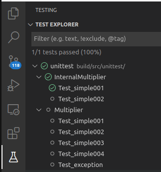
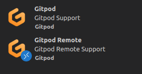
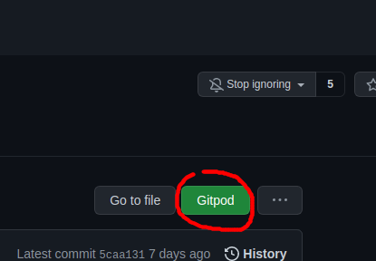

# 1. Prerequisite
- Github account (https://github.com/)
- Gitpod account (https://www.gitpod.io/)
- Installed Gitpod Extension for Chrome
(https://chrome.google.com/webstore/detail/gitpod-always-ready-to-co/dodmmooeoklaejobgleioelladacbeki)
- Authorized Access


# 2. WHY UNITTEST
UNIT TESTING is a type of software testing where individual units or components of the software are tested. The purpose is to validate that each unit of the software code performs as expected. Unit Testing is done during the development (coding phase) of an application by the developers. Unit Tests isolate a section of code and verify its correctness. A unit may be an individual function, method, procedure, module, or object.


<p style="text-align: center;"><i> The so called tests pyramid</i></p>

## 2.1. Early debug
Unit tests help to fix bugs early in the development cycle and save costs.

## 2.2. Avoid regressions so you can refactor your code
When you have a suite of unit tests, you can run it iteratively to ensure that everything keeps working correctly every time you add new functionality or introduce changes. This helps **refactoring** a lot.


## 2.3. Document your code
Running, debugging, or even just reading tests can give a lot of information about how the original code works, so you can use them as implicit documentation.  
Note that in this way the code documentation is always updated (another way the code doesn't compile)


## 2.4. Unit testing improves code coverage 

Unit testing helps to improve code coverage.

## 2.5. Unit Testing Myth
- It requires time, and I am always overscheduled
My code is rock solid! I do not need unit tests.
- Programmers think that Integration Testing will catch all errors and do not execute the unit test. Once units are integrated, very simple errors which could have been very easily found and fixed in unit tested take a very long time to be traced and fixed.

The truth is Unit testing increase the speed of development.


# 3. HOW TO UNITTEST

## 3.1. Good practices for unit testing include
- Creating tests for all **publicly exposed** functions, including class constructors and operators.
- Covering all code paths and checking both trivial and **edge cases**, including those with incorrect input data (negative testing).
- Assuring that each test works independently and doesn't prevent other tests from execution.
- Organizing tests in a way that the order in which you run them doesn't affect the results.


## 3.2. A single test
A single unit test is a method that checks some specific functionality and has clear pass/fail criteria. The generalized structure of a single test looks like this:

Test (TestGroupName, TestName)   {
- setup block
- running the under-test functionality
- checking the results (assertions block)
}


## 3.3. Modularize your code
As code's testability depends on its design, unit tests facilitate breaking it into specialized easy-to-test pieces.
An easy way to do this is to use self-consistent classes.  
Another useful technique is the so-called **dependence injection**.
It is a technique in which an object receives other objects. The receiving object is called a client and the passed-in ('injected') object is called a service. tests.   


With no partcular tecnique:  
```c++
class Test
{
    private:
        Database mydatabase_;
    public:
        int getIntFromDatabase(const std::string& query)
        {
            ...
            mydatabase_.get(query);
            ...
        }
};
```  
With inheritance  
```c++
class Test: public Database
{
    public:
        int getIntFromDatabase(const std::string& query)
        {
            ...
            get(query);
            ...
        }
};
```

With dependency injection  
```c++
class Test
{
    private:
        Database& mydatabase_;
    public:
        Test(Database &mydatabase):mydatabase_(mydatabase)
        {}
        int getIntFromDatabase(const std::string& query)
        {
            ...
            mydatabase_.get(query);
            ...
        }
};
```


The use of the inheritance technique tightly couples parent class with child class. It is harder to reuse the code and write units.  
Best choice: **dependency injection**.


## 3.4. Reference for Unittest
https://www.jetbrains.com/help/clion/unit-testing-tutorial.html#basics  
https://www.guru99.com/unit-testing-guide.html

# 4. GTEST
googletest is a testing framework developed by the Testing Technology team with Google’s specific requirements and constraints in mind. Whether you work on Linux, Windows, or a Mac.

## 4.1. The tests are simple

```c++
TEST(Multiplier, check_multiply_001)
{
    Multiplier mult;
    EXPECT_EQ(8/*expected*/, mult.invoke(4, 2)/*current*/);
}
```

**CODE**: See test:testMultiplier.cpp

## 4.2. Small important details


### 4.2.1. Expected and current order
This is only a note to remember to correctly order the expected and current value.
```c++
    EXPECT_EQ(8/*expected*/, mult.invoke(4, 2)/*current*/);
```
The unittest framework usually gives the error log based on this assumption.

```
./training-programming-best-practices/unittest-course-part/src/unittest/testMultiplier.cpp:21: Failure
Expected equality of these values:
  8
  mult.invoke(4, 2)
    Which is: 7
[  FAILED  ] Multiplier.Test_simple001 (0 ms)
```

### 4.2.2. Name

Choose good names for tests see for reference:https://dev.to/canro91/unit-testing-best-practices-6-tips-for-better-names-524m.


- Choose a naming convention for your test names and stick to it.
- Every test name should tell the scenario under test and the expected result. Don't worry about long test names. But, don't name your tests: Test1, Test2 and so on.
- Describe in your test names what your testing in a language easy to understand even for non-programmers.

❌ Don't prefix your test names with "Test". If you're using a testing framework that doesn't need keywords in your test names, don't do that.  


## 4.3. Check macro
Other EXPECT and ASSERT macro exist:  
```c++
EXPECT_TRUE
EXPECT_FALSE
EXPECT_EQ  
EXPECT_NE
EXPECT_GT
...
ASSERT_TRUE
ASSERT_FALSE
ASSERT_EQ  
ASSERT_NE
ASSERT_GT
...
FAIL
```

See also:  
https://github.com/google/googletest/blob/main/docs/reference/assertions.md


## 4.4. Check fatal/non fatal macro
ASSERT vs EXPECT  
```c++
    EXPECT_EQ(8/*expected*/, mult.invoke(4, 2)/*current*/
    ASSERT_EQ(8/*expected*/, mult.invoke(4, 2)/*current*/
```
Assert abort the current test while Expect gives only the error but goes on.
Expect is preferred.

## 4.5. Fixtures
If you find yourself writing two or more tests that operate on similar data, you can use a test fixture. This allows you to reuse the same configuration of objects for several different tests.


**CODE**: See test:testMultiplierParamAndFixture.cpp
## 4.6. Test private members

For testing private members we can use one of the c++ features.
It is possible to change visibility over inherited members.

```c++
class Multiplier
{
    protected:
        virtual void internalInvoke();//To be tested
};


class TestMultiplier : public Multiplier
{
   public:
        using Multiplier::internalInvoke;
};
```

**CODE**: See test:testMultiplierInternal.cpp

## 4.7. Test exceptions
Also thrown exceptions can be tested.
```c++
EXPECT_THROW(mult.invoke(10, 2), std::invalid_argument);
```

**CODE**: See test:testMultiplier.cpp

## 4.8. Test with parameters

**CODE**: See test:testMultiplierParamAndFixture.cpp

## 4.9. The main
Quite easy to write:
```c++
#include "gtest/gtest.h"

int main(int argc, char **argv) {
    ::testing::InitGoogleTest(&argc, argv);
     return RUN_ALL_TESTS();
}
```

For filtering the tests add:
```c++
   ::testing::GTEST_FLAG(filter) = "Test.Test_003";
```
or you can use wildcard:
```c++
   ::testing::GTEST_FLAG(filter) = "Test.T*";
```

## 4.10. Visual studio code
VC is perfectly integrated with gtest, install the test explorer extension see:  
https://marketplace.visualstudio.com/items?itemName=hbenl.vscode-test-explorer


The test explorer:  



## 4.11. How to cmake

```cmake
include(FetchContent)
FetchContent_Declare(
  googletest
  URL https://github.com/google/googletest/archive/609281088cfefc76f9d0ce82e1ff6c30cc3591e5.zip
)
```

## 4.12. References for gtest
https://google.github.io/googletest/primer.html

# 5. GMOCK
A mock object implements the same interface as a real object (so it can be used as one), but lets you specify at run time how it will be used and what it should do (which methods will be called? in which order? how many times? with what arguments? what will they return? etc).


## 5.1. How to
When using gMock,

- first, you use some simple macros to describe the interface you want to mock, and they will expand to the implementation of your mock class.
- next, you create some mock objects and specify their expectations and behaviour using an intuitive syntax.
- then you exercise code that uses the mock objects. gMock will catch any violation of the expectations as soon as it arises.

## 5.2. MOCK vs STUB

Mocking is a way to replace a dependency in a unit under test with a stand-in for that dependency. The stand-in allows the unit under test to be tested without invoking the real dependency. 

**Stub**: Stub is an object that holds predefined data and uses it to answer calls during tests. Such as an object that needs to grab some data from the database to respond to a method call.

**Mocks**: Mocks are objects that register calls they receive. In test assertion, we can verify on Mocks that all expected actions were performed. A mock is like a stub but the test will also verify that the object under test calls the mock as expected. Part of the test is verifying that the mock was used correctly.

## 5.3. Dependency injection.

Mocking needs dependency injection to work better.
[See above](#33-modularize-your-code)

## 5.4. Disclaimed
This part of the course will be done by examples.


## 5.5. Simple mock
First of all you need to mock the class and method we do not want to test directly.
```c++
class ...
{
    ...
    MOCK_METHOD(double, getDataFromFile, (unsigned int), (const, override));  // note the parentesis
}
```
**CODE**: See test:testMultiplierFromFile.cpp

## 5.6. Simple tests

**CODE**: See test:testMultiplierFromFile.cpp

## 5.7. Test c std API
In this case is necessary write a class for overlap the c API.  
See file: InterfaceForCApi.h

**CODE**: See test:testMediaScanner.cpp

## 5.8. Reference for gmock
http://google.github.io/googletest/gmock_cook_book.html


# 6. GitPod
How to:
- Fork the [training repo](https://github.com/icub-tech-iit/training-programming-best-practices/blob/master/unittest-course-part/README.md)  

- Only for Visual Studio Code users. Install extension on Visual Studio Code. This step is not mandatory.  

- Enter GitPod with the button (the first time it will take 5minutes).  

- Create build folder, create makefile and compile
  ```bash
  cd /workspace/training-programming-best-practices/unittest-course-part
  mkdir build
  cmake -DCMAKE_INSTALL_PREFIX=/workspace/training-programming-best-practices/unittest-course-part/install ..
  make install
  ```

- Execute UT
```bash
cd /workspace/training-programming-best-practices/install/bin
./unittest
```
   